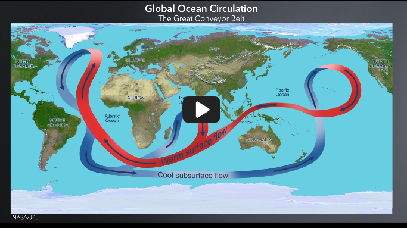

# Climate Change: The Science and Global Impact

Course site: https://courses.edx.org/courses/course-v1:SDGAcademyX+CCSI001+3T2019/course/ provided by [SDG Academy](https://sdgacademy.org/).

## Overview 

In this course, you will explore the science behind **anthropogenic climate change** with climate expert, [Michael Mann](https://en.wikipedia.org/wiki/Michael_E._Mann). By joining this course, you are becoming part of a global movement to act on climate change.

> The **first step toward any action** is **knowledge** and **understanding**.

By the end of the course, you will come away with a solid understanding of how the climate system works, why anthropogenic climate change is occurring, and the impact it has on human and planetary systems.

## About This Course

Climate change is arguably the greatest challenge of our time. Human activity has already warmed the planet by one degree Celsius relative to pre-industrial times, and we are feeling the effects through record heat waves, droughts, wildfires and flooding. If we continue to burn fossil fuels at the current rate, the planet will reach two degrees of warming by 2050 - the threshold that many scientists have identified as a dangerous tipping point. What is the science behind these projections? 

Join climate scientist expert Michael Mann to learn about the basic scientific principles behind climate change and global warming. We need to understand the science in order to solve the broader environmental, societal and economic changes that climate change is bringing. 

## Course Learning Objectives

By the end of this course, you will:

* Develop a deep scientific understanding of HOW the climate system has been changing;
* Articulate WHY the climate system is changing;
* Understand the nature of these changes;
* Develop a systems thinking approach to analyzing the impacts of climate change on both natural and human systems.

The course covers the basic principles of atmospheric science, methods of climate data collection and tracking of greenhouse gas emissions. It introduces basic climate modeling and explores the impact of various greenhouse gas emissions scenarios. Finally, it outlines the impacts of climate change on environmental, social, economic and human systems, from coral reefs and sea level rise to urban infrastructure. The course follows the general outline of the 5th Assessement Report of the United Nations Intergovernmental Panel on Climate Change.

What You Will Learn

* Principles of atmospheric science
* Climate data collection and interpretation (How data is collected and analyzed?)
* How to use basic computations and models to address future climate change?
    * Zero-dimensional Energy Balance Models 
    * One-dimensional Energy Balanced Models
    * General Circulation Models
* Future greenhouse gas emissions scenarios and projections
    * Carbon emissions scenarios
    * Future climate change projections
* Impacts of climate change on social, cultural, economic, urban and other human systems
    * Impacts on human systems
    * Emissions reduction pathways

## 1.0 Introduction to Climate and Climate Change (course intro)

- [video](https://courses.edx.org/courses/course-v1:SDGAcademyX+CCSI001+3T2019/courseware/5d206629b3e342ce8bbd943126e65c0f/0241d06be83e44c59fbec81416ad5766/?child=first)

The structure this course roughly parallels information collected in the reports of the [Intergovernmental Panel on Climate Change](https://www.ipcc.ch/) (or **IPCC**, in French, Groupe d'experts intergouvernemental sur l'évolution du climat or **GIEC**)

### 1.1 What is climate change?

The idea of climate change, highlighting the difference between weather and climate, and the history of natural climate change versus man-made climate change.

- [video](https://courses.edx.org/courses/course-v1:SDGAcademyX+CCSI001+3T2019/courseware/5d206629b3e342ce8bbd943126e65c0f/0241d06be83e44c59fbec81416ad5766/?child=first)

- Difference between Weather and Climate: "Climate is what you expect, and Weather is what you get" Mark Twain.
- Climate is always changing, but at the speed it is changing today
- - Dinausor's age really warm due to volcanc eruption. They can cool the cilamte for a few years only by hiding the sun with ther smoke, but over ten's/million's of years, their CO2 emission will warm up the planet, while today, the fast climate change is due to human activity.

### 1.2 Why should we care about climate change?

[video](https://courses.edx.org/courses/course-v1:SDGAcademyX+CCSI001+3T2019/courseware/5d206629b3e342ce8bbd943126e65c0f/0241d06be83e44c59fbec81416ad5766/?child=first)

It explains the difference between natural climate change of the past and man-made climate change today, introducing the hockey stick graph.

- Not the warmth of the Earth which threaten scientists, but its **rate of change**
- changing at a rate we are not sure we can adapt too. (probably not just us, but the entire biospehere... i.e. all today's living organisms)
- From archeology studies, we can build up knowledge about former climate change occur in the past.

The past 1000 years shows warm periods into middle age, a cool down afterward and the industrial revolution the last 2 centuries with a temperature spike upward.

This shows something profound happening today in the climate, and its implication related to our human activity.

Adaptation to climate change is possible when it occurs slowly, but the current changes, mainly due to our own activity, can be stopped. The **Paris agreement** signed in 2015 by all countries in the world, will just take us to half way (2.5 degrees celsius) to where we will be headed by the end of the century if we do nothing (5 degrees celsius)!

The Paris agreement is just a starting point. In subsequent international conferences the countries of the world will need to agree to make more stringent reductions in their carbon emissions, if we are to rise to this challenge and avert catastrophic climate change.

### 1.3 Overview of the climate system: How is the climate system constructed?

It discusses the four major components of the climate system, focusing on the structure and composition of the atmosphere. It then goes on to explain the different types of greenhouse gases and the greenhouse effect.

[video](https://courses.edx.org/courses/course-v1:SDGAcademyX+CCSI001+3T2019/courseware/5d206629b3e342ce8bbd943126e65c0f/0241d06be83e44c59fbec81416ad5766/?child=first)

The climate system includes many subsystems:

- the ocean = the hydrosphere
- the ice = the cryosphere
- and life on Earth = the biosphere

Each influence the other. All of the processes that, as we will see are important in understanding the dynamics of the earth system, the dynamics of the climate system.

**Details on layers of the atmosphere**: If we want to look for a fingerprint that tells us that the warming actually comes from the increase in greenhouse gas concentrations, the fingerprint we would look for would be a warming troposphere, but a cooling stratosphere.

About 99% of the atmosphere is made up of nitrogen and oxygen, and **only 1% accounts for all of the other trace gases, including all the greenhouse gases**. Turns out though, **those greenhouse gases** can be very potent, even in low concentrations they **can have a profound impact on the properties of our atmosphere**.

**Ideal gas law**: The atmosphere is rather uniform and behaves mostly like an ideal gas. The gas is free and volume not fixed to obey `PV = nRT` but we can use a similar law later on to model the gas in the atmosphere.  We will look at water, and especially water vapor. Water can have 3 phases: as, liquid, and solid, on earth. And water vapor is a greenhouse gas and an amplifier of amplifying factor when it comes to climate change.

The **greenhouse effect** and **how an actual greenhouse works**: an actual greenhouse blocks wind currents that would help take away the heating caused by the sunlight that's coming through the glass of the greenhouse. In the atmosphere what's happening is that the Sun is warming the planet, the planet is trying to cool off by sending heat energy out to space, but the greenhouse gases intercept some of that heat energy and some of it they allowed to escape out to space, but some of it they actually send back down towards the surface of the earth. That means that the earth has to produce even more of that outgoing heat energy to cool off enough to balance the heating of the Sun. And that causes the temperature of Earth's surface to rise. That's the greenhouse effect.

### 1.4 Overview of the climate system: How do energy balances work?

It introduces the concept of energy balances in the climate system. It compares infrared radiation to ultraviolet radiation in the context of energy balances as well as going into the process of how radiation enters and leaves the Earth's atmosphere.  

[video](https://courses.edx.org/courses/course-v1:SDGAcademyX+CCSI001+3T2019/courseware/5d206629b3e342ce8bbd943126e65c0f/0241d06be83e44c59fbec81416ad5766/?child=first)

#### Shotwave & longwave radiations

We've got this **shortwave solar radiation from the Sun** that's heating the surface of the earth and to come into balance **the earth is trying to send off this long wave infrared radiation out to space**. 

#### Energy balance

- Sun: 1370 W/m^2, but earth rotates and only 1/4th is getting warmed by the sun. Therefore on average, only 370 W/m^2 is perceived. Let's call that "100 units" of energy
- In the end it's gonna have to be balanced by a hundred units going back out to space, so that we have energy balance, so that amount of radiation coming in equals the amount of radiation going out and earth can maintain a roughly constant surface temperature.
- 23 "units" or 23% are reflected to space, 19% absorbed by the atmosphere, 4% absorbed by clouds, 47% reaching the Earth surface.
- To be balanced, these 47% of received energy from the Sun have to be balanced by heat emission (long wave radiation) that Earth's surface is sending up to space.
- Unfortunately, a large part of these are intercepted by the greenhouse gases. Once heated up, they send a little bit back to space, but a lot back to us toward the surface of the Earth.

Those 100 units of energy being sent back into space include:

* 23 units reflected by clouds
* 7 units reflected by the surface
* 49 units emitted by the atmosphere
* 9 units emitted from the clouds
* 12 units emitted from the surface directly to space

Our climate model will use this simple model to understand what temperature need to be in order to balance this incoming energy from/into space.

#### **Surplus of radiation at the Equator & deficit of radiation at the poles**

Now near the poles, where we have large ice sheets, or sea ice, a larger amount of that downward solar energy is going to be reflected directly by Earth's surface. So that component varies with latitude. Now near the equator, temperatures are considerably warmer than they are near the pole, that means that the earth is going to be sending out more of that long wave heat energy from the equator than it is going to be sending out near the poles. That's the red curve. And then the orange curve shows us that of course there's more sunlight, more of that incoming shortwave radiation at the equator, and less of it near the poles. So as you can see in this figure here, more that long-wave radiation is emitted from the warm tropical regions then in the cold polar regions, so there's a disparity here. The outgoing radiation actually exceeds the incoming radiation near the poles. There's a deficit of radiation. Conversely, near the equator, there is more incoming radiation than there is outgoing long-wave radiation. So you might ask if there's a surplus near the equator, a surplus of radiation, why doesn't the equator continue to warm up? If there's a deficit of radiation at the poles, why don't they continue to cool down?

So you might ask if there's a surplus near the equator, a surplus of radiation, why
doesn't the equator continue to warm up? If there's a deficit of radiation at the poles, why don't they continue to cool down?

Well it turns out that's because the climate system, **the ocean and the atmosphere in particular, act in a way to transport heat from low latitudes, where there's a surplus, to higher latitudes, where there's a deficit**. So in fact a key role of ocean and air currents is to relieve this instability of a surplus of radiation near the equator and a deficit of radiation near the poles.

#### Incoming radiation changes in time

incoming radiation varies in time as well, based on the time of day
and the time of season, and this distribution is influenced by Earth's
daily rotation about its axis, and Earth's annual orbit around the Sun.

The amount of shortwave radiation received from the Sun at the top of Earth's atmosphere varies as a function of both the time of day and the season.

### 1.5 Overview of the climate system: Global circulation systems

[video](https://courses.edx.org/courses/course-v1:SDGAcademyX+CCSI001+3T2019/courseware/5d206629b3e342ce8bbd943126e65c0f/0241d06be83e44c59fbec81416ad5766/?child=first)

It looks at global circulation systems, focusing on wind patterns and then on ocean patterns. It puts an emphasis on the interconnected relationship between these patterns.

#### Atmospheric motion & convective instability

**Atmospheric circulation** is a key mechanism that helps balance the distribution of solar radiation across Earth's surface. It moves the heat from the equator toward the poles. Now a key part of this mechanism involves rising **atmospheric motion**. The heating from the Sun migrates north and south within the tropics over the course of the year, and so does the tendency for rising atmospheric motion as the surface of Earth is heated in different locations.

Now **warmer air is less dense than cold air**, and that creates what we call **convective instability**, the unstable situation of having light air underneath heavy air. Where that instability exists there's a tendency for rising motion. That warm air at the surface rises and cools.

Here we have a schematic that shows the large-scale circulation cells in the atmosphere. The overall vertical circulation of the atmosphere on average
involves three circulation cells in each hemisphere.

This pattern of circulation of rising air at the equator, and rainfall near the equator, and descending dry air in the subtropics, is known as the **Hadley cell circulation**.

The atmospheric circulation system transports the surplus of solar radiation at the equator in order to relieve the deficit of solar radiation at the poles. The three key motions of the atmospheric circulation system include:
- Descending in the subtropic regions
- Rising in the subpolar/mid-latitude region
- Descending in the poles

Those differences in temperature actually drive **storm systems** which provide lifting in the atmosphere and the rising motion in that sub polar region. We call that location the **Polar Front** where cold and warm air masses mix, and where we have rising motion within those low pressure systems.

As we go up in the atmosphere, we find that the surface westerlies in the sub polar
regions actually get stronger and stronger as we go up in the troposphere, until we hit the boundary between the troposphere and the stratosphere, what's known as the **tropopause**. And at that location in the atmosphere, **between 10 and 14 kilometers above the surface**, and subpolar latitudes, we have what's known as the **jet stream**, this band of **very strong westerly winds**. Winds that blow from the west to the east. The jet stream moves mid latitude storm systems along, and the properties of the jet stream are very closely tied to mid-latitude storm systems: 
- how they progress,
- how they intensify, where they are located.

This is a highly idealized depiction of the atmospheric circulation, it represents long-term averages.

In real time these motions are associated with storm systems and convective thunderstorms in the tropics dynamical properties of the atmosphere. **All of which help Earth's climate system solve this problem of relieving the unstable situation of an equator which is heated and a polar region that is cooled**. The atmosphere is trying to transport that excess of heat from the equator towards the pole, and it does that in the form of these **atmospheric circulations**.

#### Westerly winds from Geostrophic balance: Pressure gradient force & Coriolis force

So wind patterns also transport heat poleward, the lateral wind patterns are primarily governed by what's known as the pressure gradient force and the Coriolis force, an effective force that exists due to the fact that the earth is itself rotating. This balance between the pressure gradient force and the Coriolis force is known as geostrophic balance.

As a consequence geostrophic balance leads to winds in the mid latitudes, between the subtropical high pressure belt in the sub polar low pressure belt of the polar front blowing from west to east. We call these **westerly winds**.

The westerly winds become stronger aloft, leading to the intense regions of high wind known as the **jet stream** in the mid latitude upper troposphere. Conversely winds in the tropics tend to blow from east to west, these are known as **easterly winds**, or sometimes **the trade winds**.

#### Circulations in oceans

Oceans also play a key role in relieving the radiation imbalance by transporting heat from low to high latitudes. The first type of ocean circulation is the **horizontal circulation**, the **wind-driven ocean gyres**. Now the major surface currents are associated with the ocean gyres, the warm poleward western boundary currents, such as:
- **the Gulf Stream** which is associated with the North Atlantic Ocean gyre, and - - the **Kuroshio current** associated with the North Pacific Ocean gyre. 

The second type of ocean circulation is **the vertical circulation**, and in particular what we call the **meridianal overturning circulation**, or sometimes simply the conveyor belt ocean circulation.

Now this ocean circulation pattern is associated with a tendency for sinking motion in the high latitudes of the North Atlantic and rising motion more broadly in the tropics and subtropics of the Indian and Pacific Ocean.

The circulation pattern is **driven by contrasts in density**, which are in turn largely **due to variations in both temperature and salinity of seawater**, hence the term that sometimes used to describe this circulation, the **thermohaline circulation**.

The thermohaline circulation system in the oceans transports heat energy from the equator to the poles. The two key motions of the oceanic circulation systems include:

- Rising motion in the southern Indian and Pacific Oceans
- Sinking motion in the north Atlantic Ocean

#### El Niño Southern Oscillation or ENSO

Just as the atmosphere exhibits natural internal variability that we call weather, the climate system itself exhibits natural internal variability on longer timescales, and the most important and most familiar of those modes of natural internal variability in the climate system is the El Niño Southern Oscillation or ENSO.

Typically when that happens, every few years at about Christmas time and hence the name **El Niño**, which corresponds to the Christ child, because the native South Americans saw that this phenomenon would tend to happen around Christmas in the boreal winter. So those waters warm up in the Eastern equatorial Pacific, and that changes the relative east-west pattern of temperature along the equatorial Pacific. But that east-west pattern of temperature drives a vertical circulation in the atmosphere, that's called the **Walker circulation**, and the change in that Walker circulation changes the strength of the trade winds. And so we've now come full circle:
- if you change the trade winds, you change the upwelling of cold water in the
tropical Pacific Ocean,
- but if you change the upwelling of cold water you change the temperature patterns - which influence the atmospheric circulation pattern,
- which determines the trade winds in the first place.

And so this is an example of a coupled ocean atmosphere mode of variability you can't understand El Niño by just understanding the atmosphere. You can't understand the El Niño Southern Oscillation by understanding just the ocean. You have to understand how they interact with each other to yield this mode of variability, which tends to vary on timescales of three to seven years. 

#### Complexity & unknown consequences

So there are all sorts of phenomena that are a great interest and concern to us that are influenced by El Niño and if climate change changes El Niño it's going to impact these phenomena. We still don't know exactly what those impacts will be, and hence there is uncertainty in these regional impacts of climate change. But once again uncertainty isn't our friend because you can't plan for or adapt to changes that you don't know are coming.

### 1.6 Other fundamental principles: Feedback mechanisms and the carbon cycle

[video](https://courses.edx.org/courses/course-v1:SDGAcademyX+CCSI001+3T2019/courseware/5d206629b3e342ce8bbd943126e65c0f/0241d06be83e44c59fbec81416ad5766/?child=first)

It discusses the different types of **radiative forcing**, **feedback mechanisms**, and the **carbon cycle** in relation to the climate system.

#### radiative forcing

Some of the natural forces influencing climate change, for example:
- volcanic eruptions emit what are known as aerosols, particles into the atmosphere that block some of the incoming sunlight and influence our climate
- in the same way that driving cars emit CO2 into the atmosphere.

**So how do we know which changes are driving observed climate changes? **

This IPCC graphs shows warming & cooling agents:

But the anthropogenic (i.e. human) forcing of our climate has been the dominant forcing acting mainly in the warming direction.

#### Feedback mechanisms: positive & negative

i.e. the response of the climate to forcings would be much weaker without
the influence of these so-called **feedback mechanisms**. Now feedback
mechanisms are mechanisms within the climate system that act to either
attenuate a negative feedback, or amplify a positive feedback.

A **positive feedback** is one which multiplies the impact of the forcings. For example:
- the **water vapor feedback**. A warming atmosphere can hold larger amounts of water vapor of moisture.
- the **Ice Albedo feedback** is another important feedback within the climate system. The surface of the earth has less snow or ice as it warms, leading to less reflection and greater absorption of that incoming shortwave solar radiation, another important positive feedback.

As the amount of greenhouse gases in the atmosphere increases due to fossil fuel burning, the Earth’s temperature increases. As the Earth’s temperature increases, ice melts faster at the poles. As the ice melts faster at the poles, more incoming solar radiation is absorbed and less is reflected back to space, which results in even more warming of the Earth. This is an example of positive feedback mechanism.

Then there are **cloud radiative feedbacks**. Now these are different competing effects that can be **both positive and negative**. For example:

- if a warmer atmosphere happens to produce more low clouds, the primary impact of this greater cloud cover would be to reflect more solar radiation out to space, a cooling effect, that would be a negative feedback.
- On the other hand if a warmer atmosphere produces more high clouds, like cirrus clouds the primary impact of these thin high clouds is to actually increase the greenhouse effect due to their ability to trap much of the outgoing long-wave terrestrial radiation while remaining largely transparent to incoming shortwave solar radiation, that would be a positive feedback.

The **net effect** of all these feedbacks is positive, and it serves to increase the warming that we would expect due to a particular external forcing, be it increased greenhouse gas concentrations due to fossil fuel burning, or increased solar output.

When it comes to the net effect of all of these feedback mechanisms, there's actually a related concept that we'll talk about later known as **climate sensitivity**. It addresses the question how much warming do you get if you double, say the concentration of greenhouse gases in the atmosphere, and how much warming you get will depend not just on the increase in those greenhouse gas concentrations but all of those feedback mechanisms that we talked about. 

Calculating Earth’s climate sensitivity - how many degrees the Earth will warm due to a doubling of greenhouse gases in the atmosphere - must take into account two major factors:

- The amount of additional greenhouse gases in the atmosphere
- The influence of feedback mechanisms

#### Carbon cycle

In the past, climate modelers used to do experiments where they would increase the concentration of greenhouse gases in their model and then calculate the expected warming. 

But that construction is somewhat artificial because activities such as fossil fuel-burning do not directly regulate the concentration of carbon dioxide or other greenhouse gases, but instead govern the atmospheric emissions, which interact with the climate system. As you can see here the ocean and the terrestrial biosphere and the marine biosphere, life on earth all interact with the atmosphere and oceans in what's known as the **global carbon cycle**.

For our purposes what's important here is that when we put carbon dioxide into the atmosphere by burning fossil fuels, at least historically some of that carbon dioxide has actually been absorbed by the climate system either by trees and
forests on land or by marine life plankton and algae in the ocean. And it turns out that **the ocean, the marine biosphere and the terrestrial biosphere have been absorbing almost half of the CO2 that we've been putting into the atmosphere**. That leads to CO2 concentrations that haven't increased as rapidly as we would have expected if all of the carbon dioxide remained in the atmosphere. 

**These sinks of carbon** the ocean sink and the land carbon sink that have been taking up some of the carbon we've been putting into the atmosphere, **are not necessarily constant. They may saturate,** they may no longer be able to take up all of that carbon. And if that happens, then carbon will accumulate even faster in the atmosphere. And here's something else, as we warm the permafrost, as we warm the icy regions of the coastal shelves of the world's oceans, there is methane that has been trapped there that may be released into the atmosphere. Now methane is an even more potent greenhouse gas than carbon dioxide, so if that happens, if the warming triggers the release of methane, then that will further increase the greenhouse effect. These are what are known as carbon cycle feedbacks, where carbon in the form of CO2 or methane becomes mobilized by the warming of the climate system itself, adding to the greenhouse effect and adding further to the warming. 

There's still large amounts of **uncertainty as to how much of that carbon might be mobilized** and put back into the atmosphere with additional warming. That  uncertainty is not a reason for comfort, uncertainty isn't our friend here because increasingly we're finding that these mechanisms may allow for far greater warming then we calculated in past decades when we didn't really deal with the dynamic nature of the carbon cycle in our climate modeling experiments.

### Readings for Module 1

- [IPCC 2014: Climate Change Synthesis Report, Summary for Policymakers](https://prod-edxapp.edx-cdn.org/assets/courseware/v1/66ed0c249f5b122b3bfdec45633f4cd6/asset-v1:SDGAcademyX+CCSI001+3T2019+type@asset+block/Module_1_Reading_1.pdf)

   Citation: IPCC, 2014: Climate Change 2014: Synthesis Report. Contribution of Working Groups I, II and III to the Fifth Assessment Report of the Intergovernmental Panel on Climate Change [Core Writing Team, R.K. Pachauri and L.A. Meyer (eds.)]. IPCC, Geneva, Switzerland, 1-31.

- [IPCC 2014: Future Climate Changes, Risk and Impacts: Table 2.3](https://prod-edxapp.edx-cdn.org/assets/courseware/v1/23f1592c9a589850b51429c9803f7206/asset-v1:SDGAcademyX+CCSI001+3T2019+type@asset+block/Module_1_Reading_2.pdf)

   Citation: IPCC, 2014: Climate Change 2014: Synthesis Report. Contribution of Working Groups I, II and III to the Fifth Assessment Report of the Intergovernmental Panel on Climate Change [Core Writing Team, R.K. Pachauri and L.A. Meyer (eds.)]. IPCC, Geneva, Switzerland, 71-72.

- [The Earth-Atmosphere Energy Balance](https://prod-edxapp.edx-cdn.org/assets/courseware/v1/ae7deb4a7bae8e31d7964fefaba02c0f/asset-v1:SDGAcademyX+CCSI001+3T2019+type@asset+block/Module_1_Reading_3.pdf)

   Citation: The National Weather Service. (n.d.). The Earth-Atmosphere Energy Balance. Retrieved from Weather.gov: https://www.weather.gov/jetstream/energy

- [Climate and Earth's Energy Budget](https://prod-edxapp.edx-cdn.org/assets/courseware/v1/6cb630274ba4ed6f6c5b9b5568644dee/asset-v1:SDGAcademyX+CCSI001+3T2019+type@asset+block/Module_1_Reading_4.pdf)

   Citation: Lindsey, R. (2009, January 14). Climate and Earth’s Energy Budget. Retrieved from Earth Observatory: https://earthobservatory.nasa.gov/features/EnergyBalance

- [Greenhouse Effect](https://prod-edxapp.edx-cdn.org/assets/courseware/v1/f40bce9bb2f3570cc65b5303558ab895/asset-v1:SDGAcademyX+CCSI001+3T2019+type@asset+block/Module_1_Reading_5.pdf) 

   Citation: North Carolina State University Climate Office. (n.d.). Greenhouse Effect. Retrieved from North Carolina Climate Office: https://climate.ncsu.edu/edu/GreenhouseEffect
